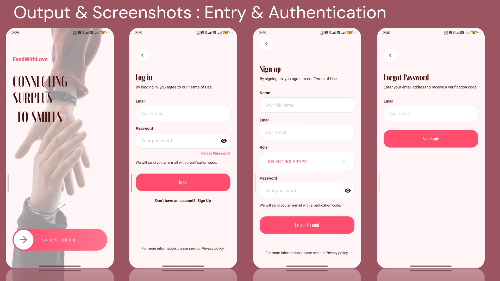
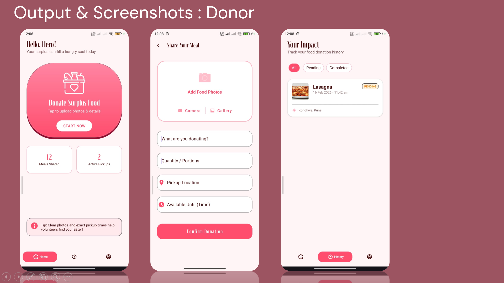
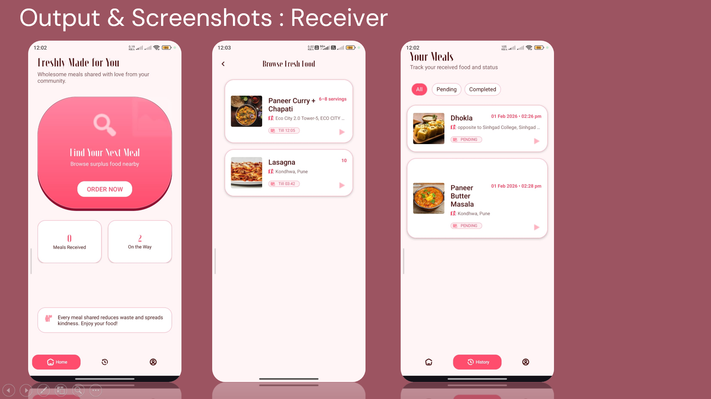
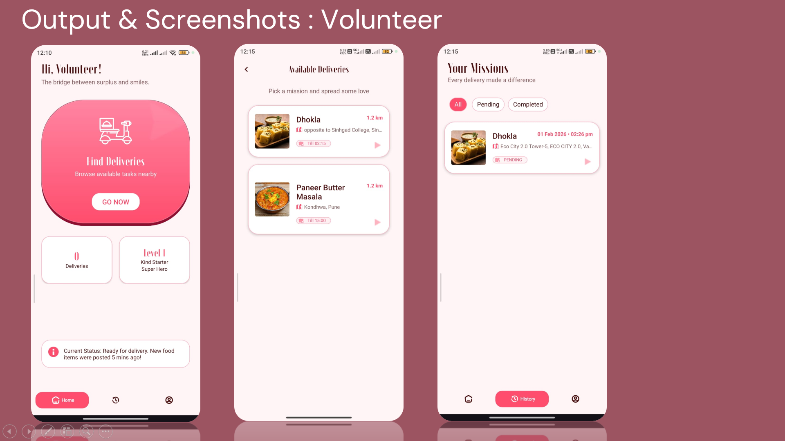

# 💖 FeedWithLove

**Connecting Surplus to Smiles.**

A social impact Android application designed to bridge the gap between food waste and hunger. FeedWithLove seamlessly connects generous food donors, individuals in need of meals, and dedicated volunteers to ensure surplus food reaches those who need it most.

## 📸 App Showcase

<div align="center">
  <table>
    <tr>
      <td align="center"><b>Entry & Authentication</b></td>
      <td align="center"><b>Donor Dashboard</b></td>
    </tr>
    <tr>
      <td></td>
      <td></td>
    </tr>
    <tr>
      <td align="center"><b>Receiver Dashboard</b></td>
      <td align="center"><b>Volunteer Dashboard</b></td>
    </tr>
    <tr>
      <td></td>
      <td></td>
    </tr>
  </table>
</div>

## ✨ Key Features & User Roles

The application provides distinct, customized UI flows based on the user's selected role during onboarding:

### 🔐 Authentication & Onboarding
* **Role-Based Sign Up:** Users select their primary role (Donor, Receiver, or Volunteer) upon account creation.
* **Secure Access:** Features a robust login system with secure password recovery capabilities.
* **Modern Aesthetic:** A welcoming, minimal, and modern interface featuring a warm pink and white theme that guides the user smoothly into the app.

### 🍲 1. Donor Module ("Hello, Hero!")
* **Donate Surplus Food:** Easily list surplus food by adding photos (via Camera or Gallery), exact descriptions, portion quantities, and pickup locations.
* **Time-Sensitive Listings:** Set an "Available Until" time to ensure food safety and urgency.
* **Impact Tracking:** Monitor active pickups and view a comprehensive history of shared meals, categorized by 'Pending' and 'Completed' statuses.

### 🍽️ 2. Receiver Module ("Freshly Made for You")
* **Find Next Meal:** Browse an interactive feed of fresh, available food nearby with details on servings, location, and availability time.
* **Order Tracking:** Track the real-time status of claimed meals.
* **Community Support:** Receive meals securely and efficiently with integrated pickup/delivery coordination.

### 🛵 3. Volunteer Module ("Hi, Volunteer!")
* **Find Deliveries:** Browse available delivery missions nearby, displaying exact distances (e.g., 1.2 km) and time windows.
* **Mission Tracking:** Accept deliveries and track your active missions as the vital bridge between donors and receivers.
* **Gamification:** Features a leveling system (e.g., "Level 1: Kind Starter Super Hero") to encourage, track, and reward volunteer efforts.

## 🛠️ Tech Stack & Architecture

* **Frontend:** Android (Java / XML) utilizing modern, interactive Material Design components.
* **Backend & Database:** Firebase for real-time data syncing, role management, and post coordination.
* **Authentication & Storage:** AWS Cognito for secure identity management and AWS S3 for reliable cloud media storage (food photos and profile assets).

## 🚀 Getting Started

### Prerequisites
* Android Studio (Latest stable version recommended)
* JDK 11 or higher
* Configured `google-services.json` for Firebase integration
* AWS Configuration properties for Cognito and S3

### Installation
1. Clone the repository:
   ```bash
   git clone [https://github.com/Team-Namah/feedwithlove-android.git](https://github.com/Team-Namah/feedwithlove-android.git)
   ```
2. Open the project in **Android Studio**.
3. Place your `google-services.json` file in the `app/` directory.
4. Create a `local.properties` file in the root directory and add your required AWS credentials:
   ```properties
   AWS_COGNITO_POOL_ID="your_cognito_pool_id"
   AWS_S3_BUCKET_NAME="your_s3_bucket_name"
   ```
5. Sync the project with Gradle files.
6. Build and run the application on an emulator or physical Android device.

## 🤝 Contributing
Contributions make the open-source community an amazing place to learn, inspire, and create. Any contributions you make to this social impact project are **greatly appreciated**. Feel free to fork the repo and submit a pull request!

## 📄 License
This project is licensed under the MIT License - see the [LICENSE](LICENSE) file for details. Copyright (c) 2026 Team Namah.
